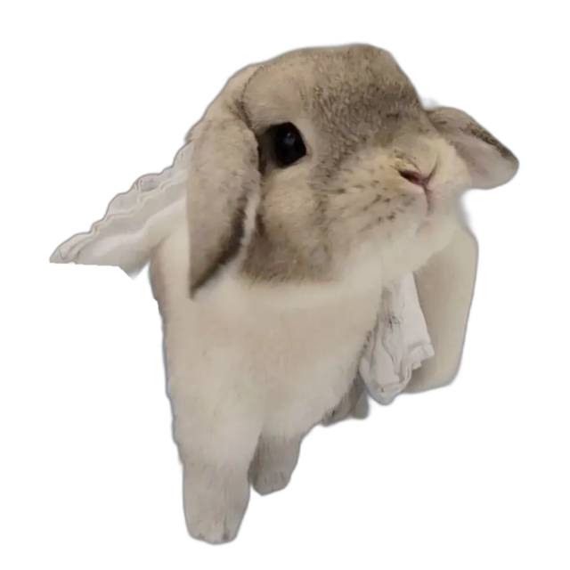
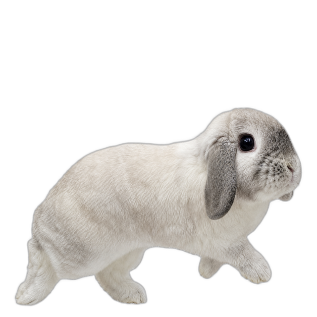
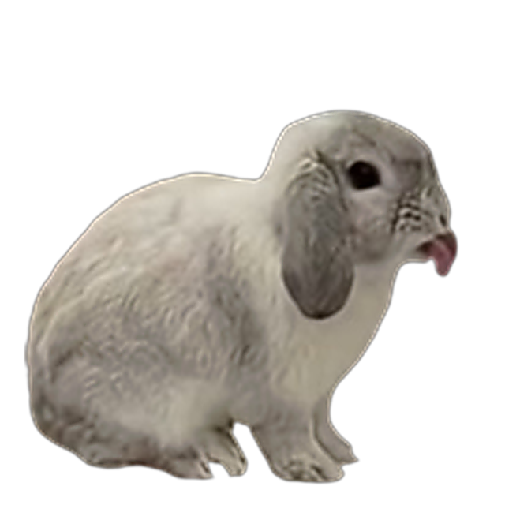
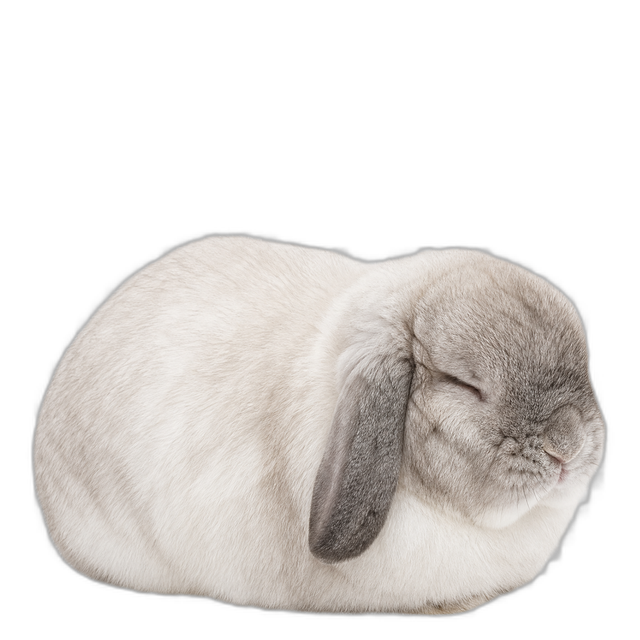
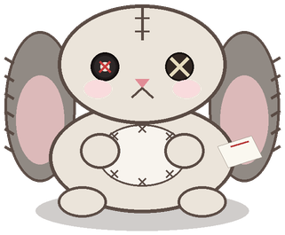
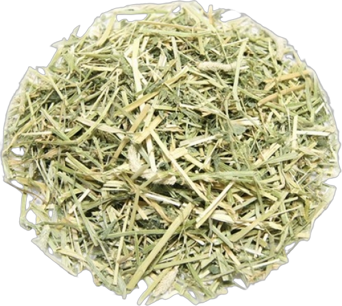
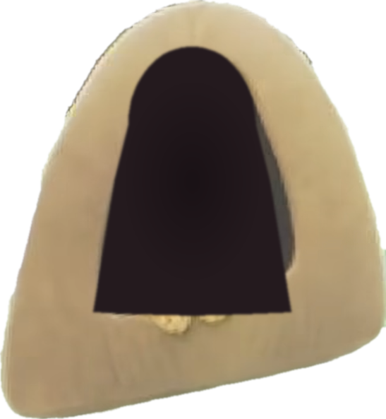
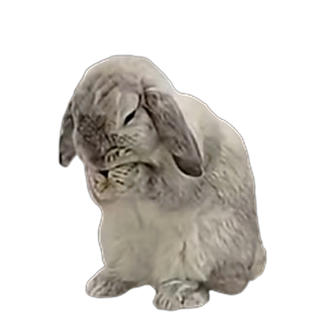

# 민트 키우기 🐰

<p align="center">
  <a href="https://uhdh.github.io/pet_mint/">
    
  </a>
</p>

<p align="center">
  화면 아래를 자유롭게 돌아다니는 가벼운 Windows 데스크톱 토끼입니다.<br>
  인터넷 연결이나 계정 없이 컴퓨터 안에서만 동작합니다.
</p>

<p align="center">
  <a href="https://apps.microsoft.com/detail/9P717Q34DQDF?hl=ko-kr&gl=KR&ocid=pdpshare"><strong>Microsoft Store에서 설치</strong></a>
  ·
  <a href="https://uhdh.github.io/pet_mint/">웹사이트</a>
  ·
  <a href="https://github.com/uhdh/pet_mint/releases/latest">GitHub Release</a>
</p>

## 민트와 놀기

| 산책 | 쓰다듬기 | 휴식 |
|:---:|:---:|:---:|
|  |  |  |
| 화면 아래를 천천히 산책해요. | 클릭하면 하트로 답해요. | 가끔 식빵 자세로 쉬어요. |

| 장난감 | 간식 | 집 |
|:---:|:---:|:---:|
|  |  |  |

민트를 마우스로 끌어 원하는 위치에 놓을 수 있습니다. 우클릭 메뉴에서는 움직임 일시 정지, 항상 위에 표시, 화면 오른쪽 아래로 복귀, Windows 시작 시 자동 실행과 종료를 설정할 수 있습니다.

## 설치

가장 안전하고 간편한 방법은 [Microsoft Store](https://apps.microsoft.com/detail/9P717Q34DQDF?hl=ko-kr&gl=KR&ocid=pdpshare)입니다.

직접 실행 파일이 필요하면 [GitHub Releases](https://github.com/uhdh/pet_mint/releases/latest)에서 ZIP을 받을 수 있습니다. 서명되지 않은 직접 다운로드 파일은 Windows SmartScreen 경고가 표시될 수 있습니다.

지원 환경: Windows 10/11 x64

## 개발

네이티브 앱은 .NET Framework 4.8 WPF로 제작되며 Electron, Chromium, Node.js를 포함하지 않습니다.

```powershell
powershell -NoProfile -ExecutionPolicy Bypass -File scripts/test-native.ps1
powershell -NoProfile -ExecutionPolicy Bypass -File scripts/build_native_store_msix.ps1
```

레거시 Electron 버전:

```bash
pnpm install
pnpm test
pnpm start
```

## 개인정보 보호

민트 키우기는 네트워크 요청, 광고, 분석 도구 또는 개인정보 수집 기능을 포함하지 않습니다. 모든 설정과 동작은 사용자의 컴퓨터 안에서만 처리됩니다.

<p align="center">
  
</p>
